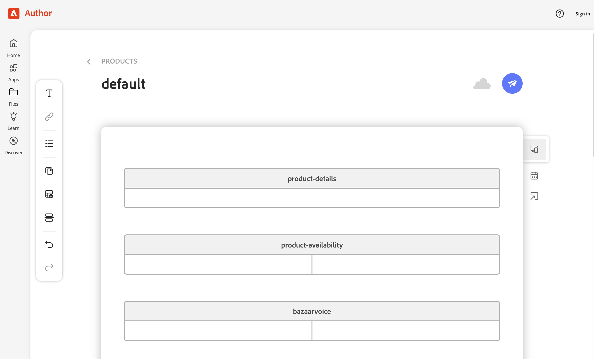

# EDS and Storefront Blocks

Blocks are how display reviews from within Edge Delivery Services and Adobe Commerce Storefront. They are easy to setup and configure, but require the app to be properly configured before they can work.

## Installation

This guide assumes you have a compatible Edge Delivery Services installation already.

1. Copy the block directories in this `blocks/` directory into your storefront's `blocks` directory.

2. Commit and deploy these to your aem.page or aem.live instances to enable them.

3. In the _content repository_ `configs` and `configs-dev` sheets, add the following and publish:

| key                    | value                                                                                                          |
| ---------------------- | -------------------------------------------------------------------------------------------------------------- |
| yotpo-config-url | https://xxxxxx-yotpo-stage.adobeioruntime.net/api/v1/web/aio-commerce-yotpo-app/yotpo-config |

This value can be found when you deploy the app in the deployment output in the console.

4. In your _content repository_ such as https://da.live/, navigate to the `<store>/products/default` document, and create a block named `yotpo`, like so:

5. Test your storefront and ensure reviews are showing up correctly. Be sure to configure the integration in the Adobe Commerce Admin.
